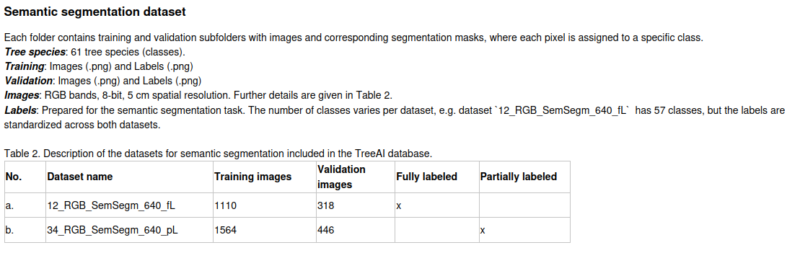
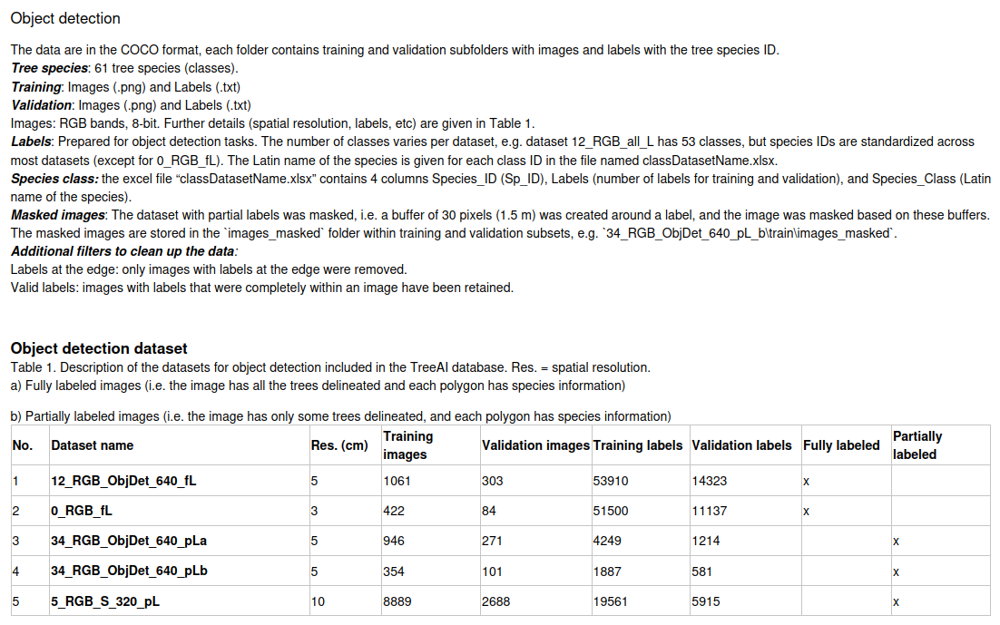

# Notes

## Semantic segmentation

Result format: .npy containing per-pixel predictions for each testing image, 2D same dimensions as input image
(in zipped folder titled predictions/, each file should be testing image file name without extras)

Evaluation function: mean IoU as ranking
Extra evaluation on accuracy, precision and F1 score

## Object detection

Result format: single predictions.txt in zip file
Each line: one bounding box, format:
    img_id(filename) cls(class label) x_center y_center width height confidence

Evaluation function: mAP@50 — Mean Average Precision at an IoU threshold of 0.50
Extra evaluation: mAP@50–95 — Mean Average Precision averaged over IoU thresholds from 0.50 to 0.95 (in steps of 0.05)

